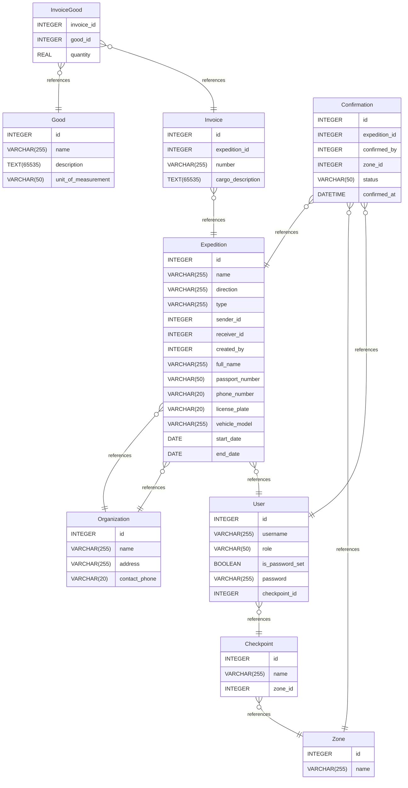

# Untitled Diagram documentation
## Summary

- [Introduction](#introduction)
- [Database Type](#database-type)
- [Table Structure](#table-structure)
	- [Good](#Good)
	- [Invoice](#Invoice)
	- [InvoiceGood](#InvoiceGood)
	- [Expedition](#Expedition)
	- [Organization](#Organization)
	- [Confirmation](#Confirmation)
	- [Zone](#Zone)
	- [Checkpoint](#Checkpoint)
	- [User](#User)
- [Relationships](#relationships)
- [Database Diagram](#database-Diagram)

## Introduction

## Database type

- **Database system:** SQLite
## Table structure

### Good

| Name        | Type          | Settings                      | References                    | Note                           |
|-------------|---------------|-------------------------------|-------------------------------|--------------------------------|
| **id** | INTEGER | 🔑 PK, not null, unique, autoincrement |  | |
| **name** | VARCHAR(255) | not null |  | |
| **description** | TEXT(65535) | null |  | |
| **unit_of_measurement** | VARCHAR(50) | null |  |Единицы измерения:
 шт (штуки),
 кг (килограммы),
 л (литры),
 м (метры) | 

### Invoice

| Name        | Type          | Settings                      | References                    | Note                           |
|-------------|---------------|-------------------------------|-------------------------------|--------------------------------|
| **id** | INTEGER | 🔑 PK, not null, unique, autoincrement |  | |
| **expedition_id** | INTEGER | not null | fk_Invoice_expedition_id_Expedition | |
| **number** | VARCHAR(255) | not null |  | |
| **cargo_description** | TEXT(65535) | null |  | | 

### InvoiceGood

| Name        | Type          | Settings                      | References                    | Note                           |
|-------------|---------------|-------------------------------|-------------------------------|--------------------------------|
| **invoice_id** | INTEGER | not null | fk_InvoiceGood_invoice_id_Good | |
| **good_id** | INTEGER | not null | fk_InvoiceGood_good_id_Invoice | |
| **quantity** | REAL | not null |  | | 

### Expedition

| Name        | Type          | Settings                      | References                    | Note                           |
|-------------|---------------|-------------------------------|-------------------------------|--------------------------------|
| **id** | INTEGER | 🔑 PK, not null, unique, autoincrement |  | |
| **name** | VARCHAR(255) | not null |  | |
| **direction** | VARCHAR(255) | not null |  | |
| **type** | VARCHAR(255) | not null |  | |
| **sender_id** | INTEGER | not null | fk_Expedition_sender_id_Organization | |
| **receiver_id** | INTEGER | not null | fk_Expedition_receiver_id_Organization | |
| **created_by** | INTEGER | not null | fk_Expedition_created_by_User | |
| **full_name** | VARCHAR(255) | null |  | |
| **passport_number** | VARCHAR(50) | null |  | |
| **phone_number** | VARCHAR(20) | null |  | |
| **license_plate** | VARCHAR(20) | null |  | |
| **vehicle_model** | VARCHAR(255) | null |  | |
| **start_date** | DATE | null |  | |
| **end_date** | DATE | null |  | | 

### Organization

| Name        | Type          | Settings                      | References                    | Note                           |
|-------------|---------------|-------------------------------|-------------------------------|--------------------------------|
| **id** | INTEGER | 🔑 PK, not null, unique, autoincrement |  | |
| **name** | VARCHAR(255) | not null |  | |
| **address** | VARCHAR(255) | null |  | |
| **contact_phone** | VARCHAR(20) | null |  | | 

### Confirmation

| Name        | Type          | Settings                      | References                    | Note                           |
|-------------|---------------|-------------------------------|-------------------------------|--------------------------------|
| **id** | INTEGER | 🔑 PK, not null, unique, autoincrement |  | |
| **expedition_id** | INTEGER | not null | fk_Confirmation_expedition_id_Expedition | |
| **confirmed_by** | INTEGER | not null | fk_Confirmation_confirmed_by_User | |
| **zone_id** | INTEGER | not null | fk_Confirmation_zone_id_Zone | |
| **status** | VARCHAR(50) | not null |  | |
| **confirmed_at** | DATETIME | null |  | | 

### Zone

| Name        | Type          | Settings                      | References                    | Note                           |
|-------------|---------------|-------------------------------|-------------------------------|--------------------------------|
| **id** | INTEGER | 🔑 PK, not null, unique, autoincrement |  | |
| **name** | VARCHAR(255) | not null |  | | 

### Checkpoint

| Name        | Type          | Settings                      | References                    | Note                           |
|-------------|---------------|-------------------------------|-------------------------------|--------------------------------|
| **id** | INTEGER | 🔑 PK, not null, unique, autoincrement |  | |
| **name** | VARCHAR(255) | not null |  | |
| **zone_id** | INTEGER | not null | fk_Checkpoint_zone_id_Zone | | 

### User

| Name        | Type          | Settings                      | References                    | Note                           |
|-------------|---------------|-------------------------------|-------------------------------|--------------------------------|
| **id** | INTEGER | 🔑 PK, not null, unique, autoincrement |  | |
| **username** | VARCHAR(255) | not null |  | |
| **role** | VARCHAR(50) | not null |  | |
| **is_password_set** | BOOLEAN | not null |  | |
| **password** | VARCHAR(255) | null |  | |
| **checkpoint_id** | INTEGER | null | fk_User_checkpoint_id_Checkpoint | | 

## Relationships

- **InvoiceGood to Good**: many_to_one
- **InvoiceGood to Invoice**: many_to_one
- **Invoice to Expedition**: many_to_one
- **Expedition to Organization**: many_to_one
- **Expedition to Organization**: many_to_one
- **Confirmation to Expedition**: many_to_one
- **Confirmation to Zone**: many_to_one
- **Checkpoint to Zone**: many_to_one
- **User to Checkpoint**: many_to_one
- **Confirmation to User**: many_to_one
- **Expedition to User**: many_to_one

## Database Diagram

